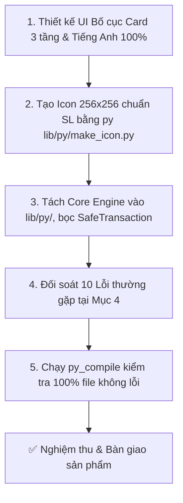

# 🍌 MEPANANA EXTENSION — BẢN KẾ HOẠCH & TIÊU CHUẨN PHÁT TRIỂN TOÀN DIỆN (DEVELOPER PLAYBOOK)
> **Tài liệu quy chuẩn cốt lõi:** Bố trí Bố cục UI/UX linh hoạt • Hộp thoại Thông báo Đồng bộ • Tiêu chuẩn Icon • Kiến trúc Code • Danh mục 6 Lỗi thường gặp & Giải pháp triệt để.

---

## 🎨 1. QUY ĐỊNH BẮT BUỘC VỀ ICON (ROOT BENCHMARK: SCHEDULE LINK `SL`)

Tất cả icon công cụ trên Ribbon **BẮT BUỘC TUÂN THỦ TUYỆT ĐỐI** theo số đo pixel chuẩn của `Schedule Link.pushbutton\icon.png`:

```
┌─────────────────────────────────────────────────────────────┐
│  Canvas: 256 x 256 px (32-bit ARGB PNG, 100% Transparent)   │
│                                                             │
│  ┌───────────────────────────────────────────────────────┐  │  ◄── Y = 50 (Top Margin: 50px)
│  │                                                       │  │
│  │             S E G O E   U I   B O L D                 │  │  ◄── Height: Đúng 160px (Y=50 -> 210)
│  │            (Condensed Factor: 0.80)                   │  │  ◄── Width: 160px - 235px (Centered)
│  │                                                       │  │
│  └───────────────────────────────────────────────────────┘  │  ◄── Y = 210 (Bottom Margin: 46px)
│                                                             │
│  Gradient: Emerald (#15C27D) ──► Amber (#F48712) ──► Fiery Red (#F04A3C)
└─────────────────────────────────────────────────────────────┘
```

### 📊 Bảng Thông Số Đo Đạc Icon Chi Tiết:
| Hạng Mục Đo Đạc | PushButton (Nút Lớn Ribbon) | StackButton (Nút Nhỏ Xếp 3 Hàng) |
|---|---|---|
| **Kích thước Canvas** | $256 \times 256\text{ px}$, 32-bit ARGB PNG | $256 \times 256\text{ px}$, 32-bit ARGB PNG |
| **Bounding Box Height** | Đúng **$160\text{px}$** ($Y=50 \rightarrow Y=210$) | Đúng **$107\text{px}$** ($Y=74 \rightarrow Y=181$) |
| **Bounding Box Width** | **$160\text{px} - 235\text{px}$** (Căn giữa) | Căn giữa |
| **Font & Cỡ chữ (Pt)** | `Segoe UI Bold` (`segoeuib.ttf`), Size **$220\text{pt}$** | `Segoe UI Bold` (`segoeuib.ttf`), Size **$150\text{pt}$** |
| **Tỉ lệ co thon gọn** | Hệ số co hẹp bề ngang **$0.80$** | Hệ số co hẹp bề ngang **$0.80$** |
| **Khoảng cách ký tự** | Khoảng cách dương tự nhiên **$+8\text{px}$** | Khoảng cách dương tự nhiên **$+5\text{px}$** |
| **Dải màu Gradient** | $X=0 \rightarrow 255$: `#15C27D` $\rightarrow$ `#20CB66` $\rightarrow$ `#55C046` $\rightarrow$ `#B4BC1E` $\rightarrow$ `#EBBF13` $\rightarrow$ `#F48712` $\rightarrow$ `#F04A3C` | Tương tự |
| **Lệnh tạo tự động** | `py lib/py/make_icon.py "<TEXT>" "<OUTPUT_PATH>"` | `py lib/py/make_icon.py "<TEXT>" "<OUTPUT_PATH>" --stack` |

---

## 🖥️ 2. QUY ĐỊNH BỐ TRÍ BỐ CỤC GIAO DIỆN & TRẢI NGHIỆM NGƯỜI DÙNG (UI/UX LAYOUT)

### 2.1. Quy Chuẩn Bố Cục Thẻ 3 Tầng (3-Tier Card-Based Layout Hierarchy):
> [!NOTE]
> **Quy định về Kích Thước (Flexible Sizing):** Kích thước cửa sổ (`Width`, `Height`, `MinWidth`, `MinHeight`) **hoàn toàn linh hoạt và tùy biến theo tính năng cụ thể của từng tool** (từ các bảng cấu hình nhỏ gọn $420\text{px}$ đến các bảng dữ liệu thống kê rộng $800 - 950\text{px}$). Điều quan trọng bắt buộc là **BỐ CỤC VÀ TRẬT TỰ KHÔNG GIAN** phải đồng nhất theo sơ đồ 3 tầng dưới đây:

```
┌─────────────────────────────────────────────────────────────────────────────────────────────┐
│ 🍌 [App Icon 32x32]  TOOL TITLE (18pt Bold)                                  [v1.5.0 Badge] │ ◄── TẦNG 1: HEADER (Gọn gàng, không cần mô tả phụ)
├─────────────────────────────────────────────────────────────────────────────────────────────┤
│ ┌─ Card 1: Input / Scope / Source Selection ──────────────────────────────────────────────┐ │
│ │  • Gom nhóm nguồn dữ liệu vào: CAD Link / Active View Elements / Categories Breakdown   │ │
│ └─────────────────────────────────────────────────────────────────────────────────────────┘ │
│ ┌─ Card 2: Configuration / Parameters / Rules ────────────────────────────────────────────┐ │ ◄── TẦNG 2: BODY CARDS
│ │  • ComboBox Dropdowns (Type, Panel, Family, Level)                                      │ │      (Gom nhóm chức
│ │  • Numerical Inputs & Sliders (Snap Radius, Offsets, Tolerances)                        │ │       năng theo từng
│ └─────────────────────────────────────────────────────────────────────────────────────────┘ │       khối độc lập)
│ ┌─ Card 3: Data Grid / Preview / ListBox (Tùy chọn nếu tool có bảng dữ liệu lớn) ─────────┐ │
│ │  • Danh sách các mục dữ liệu / Sơ đồ tương tác / So sánh Diff Preview                   │ │
│ └─────────────────────────────────────────────────────────────────────────────────────────┘ │
│ ┌─ Live Progress & Real-time Status (Collapsible) ────────────────────────────────────────┐ │
│ │  [======================================== 75% ========================================] │ │
│ │  Status Text: "Processing wire 15/20 (75%) - 30 wires created..."                       │ │
│ └─────────────────────────────────────────────────────────────────────────────────────────┘ │
├─────────────────────────────────────────────────────────────────────────────────────────────┤
│ [GhostButton: Cancel / Close]                                  [PrimaryButton: Run / Apply] │ ◄── TẦNG 3: FOOTER
└─────────────────────────────────────────────────────────────────────────────────────────────┘
```

### 2.2. Các Nguyên Tắc Thiết Kế Bố Cục Chi Tiết:
1. **Header (Đầu Trang):**
   * Gọn gàng và tinh giản: Chỉ gồm Icon thương hiệu MEPANANA ($32\times32$), Tiêu đề Tool ($18\text{pt}$ Bold), và Badge phiên bản căn phải.
   * **Tuyệt đối không để dòng mô tả phụ trong UI** (Mô tả và hướng dẫn sử dụng đã do `bundle.yaml` và Tooltip của Revit đảm nhiệm).
2. **Body Cards (Thân Trang):**
   * Sử dụng các thẻ `Border Style="{DynamicResource CardStyle}"` để phân chia ranh giới logic giữa các nhóm thuộc tính, giúp người dùng không bị rối mắt.
   * Các nhãn trường dùng `Style="{DynamicResource FieldLabel}"` đặt phía trên hoặc bên trái trường nhập liệu.
   * Khoảng cách lề (Margin / Padding) giữa các Card chuẩn mực từ $10\text{px} - 15\text{px}$.
3. **Footer (Chân Trang Cố Định):**
   * Luôn đặt cố định ở đáy cửa sổ.
   * Nút phụ (`GhostButton` "Cancel" / "Close") dùng màu trung tính nhạt.
   * Nút chính (`PrimaryButton` "Run" / "Apply" / "Convert") dùng dải màu Gradient nổi bật, căn lề phải để người dùng dễ thao tác thuận tay.
4. **Trải Nghiệm Tương Tác Thông Minh (Smart UX Directives):**
   * **$100\%$ Pure English:** Toàn bộ tiêu đề, nhãn, nút bấm, tooltip và thông báo lỗi bắt buộc dùng tiếng Anh chuẩn quốc tế.
   * **Mặc Định Quét Tự Động Toàn View:** Tự động quét thiết bị trong Active View, giảm thiểu thao tác thủ công.
   * **Chống Treo Form:** Bắt buộc bọc lệnh chọn đối tượng trong `with forms.HideWindow(self):`.

---

### 2.3. Quy Chuẩn Đồng Bộ Hộp Thoại Thông Báo (Standardized Notification Dialogs):
> [!IMPORTANT]
> **Tuyệt đối KHÔNG DÙNG** `forms.alert()` mặc định của pyRevit hay `WinForms.MessageBox.Show()` vì giao diện cổ điển và không đồng bộ thương hiệu. Mọi công cụ **BẮT BUỘC SỬ DỤNG** bộ hàm thông báo chuẩn từ `py.ui`:

```python
from py.ui import show_confirm, show_error, show_info, show_success, show_warning
```

| Hàm Thông Báo | Màu Sắc / Badge | Ký Hiệu Icon | Trường Hợp Sử Dụng |
|---|:---:|:---:|---|
| **`show_success(msg, title)`** | Xanh Ngọc (`#D1FAE5`) | `✓` | Báo hoàn thành tác vụ thành công (VD: Tạo 48 wires, 3 circuits). |
| **`show_info(msg, title)`** | Xanh Lam Nhạt (`#E0F2FE`) | `ℹ` | Cung cấp hướng dẫn, thông số tóm tắt hoặc trạng thái nạp dữ liệu. |
| **`show_warning(msg, title)`** | Vàng Hổ Phách (`#FEF3C7`) | `⚠` | Cảnh báo người dùng: Chưa chọn CAD link, chưa chọn Level, nhập sai số... |
| **`show_error(msg, title)`** | Đỏ Fiery (`#FEE2E2`) | `✕` | Thông báo lỗi xử lý DB, ngoại lệ hình học hoặc lỗi kết nối. |
| **`show_confirm(msg, title)`** | Xanh Lam + 2 Nút | `?` | Hộp thoại xác nhận hành động nguy hiểm (OK / Cancel), trả về `True/False`. |

#### 🛡️ Đặc Tính Kỹ Thuật Đã Tích Hợp Sẵn Trong Bộ Hộp Thoại:
1. **Theme MEPANANA Đồng Bộ:** Tự động nạp `theme.xaml`, bo tròn góc thẻ, hiệu ứng đổ bóng mờ hiện đại.
2. **Khóa Chủ Sở Hữu (Revit Window Owner):** Tự động neo trực tiếp vào `MainWindowHandle` của Revit, không bao giờ bị ẩn hoặc trôi ra sau màn hình làm đơ Revit.
3. **Phím Tắt Thoát Nhanh (ESC Key Binding):** Nhấn phím `ESC` hoặc `Enter` để đóng hộp thoại tức thì.

---

### 2.4. Quy Chuẩn Đồng Bộ Thanh Tiến Trình & Bơm Tin Nhắn UI (Progress Bar & Dispatcher Standard):
> [!IMPORTANT]
> **TIÊU CHUẨN TRẢI NGHIỆM THỜI GIAN THỰC (NON-BLOCKING REAL-TIME UX):**
> Tất cả công cụ có tác vụ chạy nền, xử lý mảng, quét hình học hoặc đọc/ghi dữ liệu lớn bắt buộc phải tích hợp thanh `ProgressBar` ở Tầng 3 (FooterBar) và bơm tin nhắn qua `from py.ui import do_events`:

```xml
<!-- Cấu trúc XAML chuẩn tại FooterBar (Tầng 3) -->
<Border Grid.Row="2" Style="{DynamicResource FooterBar}" Height="60">
    <Grid>
        <Grid.RowDefinitions>
            <RowDefinition Height="Auto"/>
            <RowDefinition Height="*"/>
        </Grid.RowDefinitions>
        
        <!-- Live Animated Progress Bar -->
        <ProgressBar Name="progressBar" Grid.Row="0" Height="4" Margin="0,0,0,8" 
                     Visibility="Collapsed" IsIndeterminate="False" Minimum="0" Maximum="100"/>
                     
        <!-- Status Text (Left) + Buttons (Right) -->
        <Grid Grid.Row="1">
            <TextBlock Name="txtStatus" Text="Ready..." VerticalAlignment="Center" 
                       FontSize="12" Foreground="{DynamicResource MutedTextBrush}"/>
            <StackPanel Orientation="Horizontal" HorizontalAlignment="Right" VerticalAlignment="Center">
                <Button Name="btnCancel" Content="Close" Style="{DynamicResource GhostButton}" Margin="0,0,10,0"/>
                <Button Name="btnRun" Content="Run Action" Style="{DynamicResource PrimaryButton}"/>
            </StackPanel>
        </Grid>
    </Grid>
</Border>
```

```python
# Cấu trúc Code Python điều khiển chuẩn:
from py.ui import do_events

# 1. Bắt đầu: Khóa nút & Hiện thanh tiến trình
self.btnRun.IsEnabled = False
self.progressBar.Visibility = Visibility.Visible
self.progressBar.Value = 0
self.txtStatus.Text = "Initializing..."
do_events()


# 2. Hàm callback cập nhật mượt mà:
def update_prog(pct, msg):
  self.progressBar.Value = pct
  self.txtStatus.Text = msg
  do_events()  # Bơm tin nhắn Dispatcher ép UI vẽ lại ngay tức thì


try:
  # 3. Thực thi tác vụ truyền callback
  result = execute_task(..., progress_callback=update_prog)
  self.progressBar.Value = 100
  do_events()
finally:
  # 4. Thu gọn thanh tiến trình & Mở lại nút
  self.progressBar.Visibility = Visibility.Collapsed
  self.btnRun.IsEnabled = True
```

---

### 2.5. Quy Chuẩn Quản Lý Cửa Sổ (Window Lifecycle: Modeless vs Modal):
> [!IMPORTANT]
> **TIÊU CHUẨN ĐIỀU KHIỂN CỬA SỔ & TƯƠNG TÁC REVIT (WINDOW LIFECYCLE STANDARD):**
> Việc lựa chọn giữa Modal (`ShowDialog`) và Modeless (`Show` + `PushFrame`) phải tuân thủ nghiêm ngặt theo mục đích tương tác của từng công cụ:

```
┌─────────────────────────────────────────────────────────────────────────────────────────────────┐
│ 1. CỬA SỔ KHÔNG CHẶN (MODELESS): Show() + Dispatcher.PushFrame()                                │
│    ➔ DÀNH CHO: Công cụ cần người dùng vừa xem tool vừa xoay/pan/zoom Revit, chọn phần tử hoặc   │
│                 điều hướng 3D liên tục (Check Clash, Display Clash, Section Box Navigator).     │
│    ➔ CẤM GỌI Show() TRẦN TRỤI: Gọi win.Show() đơn thuần sẽ khiến Python scope bị thu gom rác    │
│       (GC) làm hỏng con trỏ callback, dẫn đến CRASH VĂNG REVIT ngay lập tức!                   │
│    ➔ MẪU CHUẨN BẮT BUỘC:                                                                        │
│       helper = WindowInteropHelper(win)                                                         │
│       helper.Owner = System.IntPtr(uidoc.Application.MainWindowHandle)                          │
│       frame = DispatcherFrame()                                                                 │
│       win.Closed += lambda s, e: setattr(frame, 'Continue', False)                              │
│       win.Show()                                                                                │
│       Dispatcher.PushFrame(frame)  # Giữ scope Python sống, bơm tin nhắn, không khóa ribbon     │
├─────────────────────────────────────────────────────────────────────────────────────────────────┤
│ 2. CỬA SỔ CHẶN (MODAL): ShowDialog()                                                            │
│    ➔ DÀNH CHO: Công cụ cấu hình ngắn, xuất dữ liệu hàng loạt (Batch Export, Shortcut Manager,   │
│                 Family Local/Cloud), nơi người dùng cần tập trung xác nhận trước khi làm việc. │
├─────────────────────────────────────────────────────────────────────────────────────────────────┤
│ 3. CHỐNG TREO DEADLOCK KHI PICK PHẦN TỬ: with forms.HideWindow(self):                           │
│    ➔ Khi đang ở cửa sổ Modal mà cần gọi PickObject / PickElementsByRectangle, BẮT BUỘC phải bọc│
│       trong 'with forms.HideWindow(self):' để ẩn form tạm thời, tránh khóa chết chuột của Revit. │
└─────────────────────────────────────────────────────────────────────────────────────────────────┘
```

---

### 2.6. Quy Chuẩn Typography & Bảng Màu DynamicResource (Zero Bold Rule):
> [!IMPORTANT]
> **TIÊU CHUẨN ĐỘ ĐẬM CHỮ TUYỆT ĐỐI (STRICT ZERO BOLD RULE):**
> 1. **Toàn bộ UI Controls (TextBlock, Label, RadioButton, CheckBox, ComboBoxItem):**
>    - **TUYỆT ĐỐI KHÔNG DÙNG** `FontWeight="Bold"` hoặc `FontWeight="SemiBold"` trong thân giao diện và badge trạng thái.
>    - Tất cả phải sử dụng độ đậm chữ `FontWeight="Normal"` mặc định.
>    - Độ đậm chỉ được phép áp dụng tự động thông qua các Style chuẩn trong `theme.xaml` (ví dụ `SectionTitle`).
> 2. **Bảng Danh Mục DynamicResource Hợp Lệ từ `lib/py/theme.xaml`:**
>    - Nền cửa sổ: `Background="{DynamicResource WindowBgBrush}"`
>    - Thẻ chứa nội dung: `Style="{DynamicResource CardStyle}"`, nền thẻ: `Background="{DynamicResource CardBgBrush}"`
>    - Đường viền: `BorderBrush="{DynamicResource BorderBrush}"`
>    - Tiêu đề mục: `Style="{DynamicResource SectionTitle}"`
>    - Nhãn trường nhập liệu: `Style="{DynamicResource FieldLabel}"`
>    - Nút hành động chính: `Style="{DynamicResource PrimaryButton}"`
>    - Nút phụ / Đóng: `Style="{DynamicResource GhostButton}"`
>    - Màu nhấn thương hiệu: `Foreground="{DynamicResource AccentBrush}"`
>    - Chữ mờ / chú thích: `Foreground="{DynamicResource MutedTextBrush}"`
>    - ⚠️ **CẢNH BÁO QUAN TRỌNG:** Key `TextBrush` **KHÔNG TỒN TẠI** trong `theme.xaml`! Tuyệt đối không gọi `{DynamicResource TextBrush}` vì sẽ làm chữ bị trong suốt hoặc rơi về màu đen mặc định lỗi. Dùng mã màu trực tiếp `#0F172A` hoặc `{DynamicResource MutedTextBrush}`.

---

### 2.7. Quy Chuẩn Hiển Thị Trực Quan AVF (Transient Analysis Visualization Standard):
> [!IMPORTANT]
> **TIÊU CHUẨN HIỂN THỊ VA CHẠM BẰNG REVIT ANALYSIS VISUALIZATION FRAMEWORK (AVF):**
> 1. **Tính chất Transient 100%:** Sử dụng `SpatialFieldManager` của Revit (`Autodesk.Revit.DB.Analysis`) để hiển thị lớp polygon va chạm trực tiếp trên Active View. **TUYỆT ĐỐI KHÔNG DÙNG** `OverrideGraphicSettings` để hiển thị va chạm vì sẽ làm bẩn database mô hình, gây xung đột View Template và không dọn sạch được.
> 2. **Bảng Phân Bổ 3 Màu Chuẩn Nhận Diện:**
>    - 🔴 **Màu Đỏ (`#EF4444` / `Color(239, 68, 68)`):** Cấu kiện Host 1 trong mô hình nội bộ.
>    - 🟠 **Màu Cam (`#F59E0B` / `Color(245, 158, 11)`):** Cấu kiện Host 2 khi va chạm giữa 2 cấu kiện **CÙNG TRONG MỘT MODEL** (giúp phân biệt ngay 2 ống/ống gió cắt nhau).
>    - 🟢 **Màu Xanh Lục (`#22C55E` / `Color(34, 197, 94)`):** Cấu kiện thuộc **FILE LINK**.
> 3. **Hình Học Trực Quan Toàn Cấu Kiện (Full Element Footprint):**
>    - Không chỉ vẽ dải ngắn tại điểm cắt. Bắt buộc vẽ polygon trải dài toàn bộ chiều dài cấu kiện từ đầu $P_0$ đến cuối $P_1$ theo đúng bề rộng thực tế của ống/ống gió/máng cáp/tường.
>    - Thứ tự 4 đỉnh polygon phải tuân thủ nghiêm ngặt chiều **Ngược Chiều Kim Đồng Hồ (Counter-Clockwise - CCW)** để lệnh `CreateExtrusionGeometry` của Revit tạo khối hợp lệ.
> 4. **Khử Trùng Lặp & Xóa Sạch Tức Thì:**
>    - Mỗi cấu kiện chỉ tạo 1 polygon AVF duy nhất (Deduplication theo ElementId).
>    - Hàm `clear_clash_analysis(doc, view)` gọi `sfm.Clear()` xóa sạch ngay lập tức trong 0.01 giây.

---

### 2.8. Quy Chuẩn Xử Lý Tác Vụ Nặng Đa Luồng (Non-blocking Background Threading):
> [!IMPORTANT]
> **TIÊU CHUẨN XỬ LÝ NỀN KHÔNG KHÓA GIAO DIỆN (BACKGROUND WORKER THREAD STANDARD):**
> Đối với các tác vụ tốn nhiều thời gian (> 2 giây) như gọi công cụ AutoCAD console (`accoreconsole`), xử lý hình học mảng lớn, nạp file đám mây hoặc xuất nhập Excel:
> 1. **Tách luồng Worker:** Luôn đẩy lệnh thực thi sang luồng phụ `threading.Thread(target=worker)`.
> 2. **Vòng lặp Polling & Dispatcher:** Luồng chính WPF chạy vòng lặp kiểm tra trạng thái luồng phụ mỗi $100\text{ms}$ (`time.sleep(0.1)`) và gọi `do_events()` để đảm bảo thanh `ProgressBar` và cửa sổ luôn phản hồi mượt mà.
> 3. **Cơ chế Timeout An Toàn:** Luôn đặt giới hạn thời gian (Timeout ví dụ $120\text{s}$) kèm cờ hủy để tránh tiến trình mồ côi (Zombie Process) làm đầy bộ nhớ máy tính.

---

## 💻 3. QUY ĐỊNH TRÌNH BÀY & BỐ CỤC CODE (CODE ARCHITECTURE)

### 3.1. Cấu Trúc Thư Mục Một Công Cụ Mới:
```
mepanana.tab\<Panel Name>.panel\<Tool Name>.pushbutton/
├── bundle.yaml    (Metadata tiêu đề, tooltip tiếng Anh, vạch phân cách)
├── icon.png       (256x256 Transparent Gradient theo chuẩn SL)
├── script.py      (Controller, Chốt chặn bảo mật, Giao tiếp UI Event)
└── ui.xaml        (WPF Card-based XAML Interface)
```

### 3.2. Bố Cục 7 Phần Chuẩn Mực Trong `script.py`:
```python
# -*- coding: utf-8 -*-
"""
1. MODULE HEADER: Title, Docstring, Version
"""
__title__ = "Tool Name"
__doc__ = "Concise description of the tool."

# 2. DYNAMIC LIB RESOLUTION & GATEKEEPER (BẢO VỆ TUYỆT ĐỐI)
import os
import sys

lib_path = os.path.abspath(
    os.path.join(os.path.dirname(__file__), "..", "..", "..", "lib")
)
if lib_path not in sys.path:
  sys.path.insert(0, lib_path)

from py.auth import is_authenticated, require_auth, update_ribbon_state

if not is_authenticated():
  update_ribbon_state(False)
  if not require_auth():
    sys.exit()

# 3. IMPORTS (CLR, .NET, REVIT API, PYREVIT, CORE UTILS)
import clr

clr.AddReference("System")
clr.AddReference("PresentationCore")
clr.AddReference("PresentationFramework")
from Autodesk.Revit.DB import *
from pyrevit import forms, revit
from py.core import SafeTransaction, get_doc, get_uidoc, mm_to_ft
from py.ui import setup_window, show_error, show_info, show_warning

# 4. BUSINESS LOGIC IMPORTS (FROM lib/py/<engine>.py)
from py.cad_wire_engine import *


# 5. UI DATA WRAPPER MODELS (Inherit from System.Object for WPF Binding)
class DisplayItem(System.Object):

  def __init__(self, element, name):
    self.Element = element
    self.DisplayName = name


# 6. MAIN WPF CONTROLLER CLASS
class MainWindow(forms.WPFWindow):

  def __init__(self):
    xaml_path = os.path.join(os.path.dirname(__file__), "ui.xaml")
    forms.WPFWindow.__init__(self, xaml_path)
    setup_window(self)  # Nạp Theme MEPANANA
    # Wire Event Handlers...

  def on_run(self, sender, e):
    # Thực thi logic...
    pass


# 7. WINDOW LAUNCHER (CHỌN 1 TRONG 2 MẪU CHUẨN)
if __name__ == "__main__":
    doc = get_doc()
    if doc:
        win = MainWindow()
        
        # ── LỰA CHỌN A: Cửa sổ Modal (Công cụ cấu hình, xuất dữ liệu) ──
        # win.ShowDialog()
        
        # ── LỰA CHỌN B: Cửa sổ Modeless (Công cụ điều hướng, soi va chạm) ──
        try:
            helper = WindowInteropHelper(win)
            helper.Owner = System.IntPtr(get_uidoc().Application.MainWindowHandle)
        except Exception:
            pass
        frame = DispatcherFrame()
        win.Closed += lambda s, e: setattr(frame, 'Continue', False)
        win.Show()
        Dispatcher.PushFrame(frame)
```

### 3.3. Tách Biệt Lõi Tính Toán (`lib/py/`):
* Toàn bộ thuật toán hình học phức tạp, duyệt đồ thị, tính toán thủy lực hay xuất nhập file **BẮT BUỘC PHẢI VIẾT THÀNH ENGINE RIÊNG** trong thư mục `lib/py/` (ví dụ `cad_wire_engine.py`, `family_cloud_engine.py`, `sprinkler_engine.py`, `clash_analysis_engine.py`).
* `script.py` chỉ đóng vai trò là **Controller điều khiển giao diện** để giữ mã nguồn luôn trong sáng, dễ bảo trì.

### 3.4. Nguyên Tắc Tận Dụng Thư Viện Sẵn Có Của pyRevit (pyRevit Built-In First):
> [!IMPORTANT]
> **TIÊU CHUẨN TỐI GIẢN CODEBASE (ZERO CODE REDUNDANCY):**
> Bất kể tính năng, tiện ích hay công cụ hỗ trợ nào đã được thư viện pyRevit cung cấp sẵn, **tuyệt đối không tự viết thêm mã tùy biến trùng lặp**! Phải ưu tiên sử dụng trực tiếp các module gốc của pyRevit:
> - `pyrevit.forms`: Cửa sổ WPF (`forms.WPFWindow`), chọn lọc đối tượng (`forms.SelectFromList`, `forms.ask_for_one_item`), thanh tiến trình (`forms.ProgressBar`), hộp thoại cảnh báo (`forms.alert`), ẩn form khi pick (`forms.HideWindow`).
> - `pyrevit.revit`: Quản lý tài liệu (`revit.doc`, `revit.uidoc`, `revit.active_view`), chọn lọc phần tử (`revit.get_selection()`), Transaction (`revit.Transaction`, `revit.TransactionGroup`).
> - `pyrevit.DB` & `pyrevit.UI`: Truy xuất nhanh toàn bộ namespace của Autodesk Revit API mà không cần khai báo clr thủ công rườm rà.
> - `pyrevit.script`: Nhật ký thực thi (`script.get_logger`), ghi log, đầu ra output (`script.get_output`), lưu trữ cấu hình (`script.get_config`, `script.save_config`).
> - `pyrevit.framework`: Các kiểu dữ liệu cơ bản .NET (`ObservableCollection`, `List`, `Action`, `Uri`, `Dispatcher`).

---

## ⚠️ 4. BẢNG KIỂM SOÁT PHÒNG NGỪA 10 LỖI KINH ĐIỂN (PRE-FLIGHT QUALITY GATE)

```
┌──────────────────────────────────────────────────────────────────────────────────────────────────────────┐
│ 🔴 LỖI 1: MŨI TÊN TRẮNG THỪA TRÊN DÂY WIRE                                                                │
│ ➔ NGUYÊN NHÂN: Truyền lẻ 1 connector (start_conn, None) vào Wire.Create.                                 │
│ ➔ GIẢI PHÁP: Luôn truyền đủ cặp (start_conn, end_conn) hoặc (None, None). CẤM truyền (start_conn, None). │
├──────────────────────────────────────────────────────────────────────────────────────────────────────────┤
│ 🔴 LỖI 2: DÂY THẲNG 2 ĐIỂM VĂNG LỖI ARGUMENTEXCEPTION                                                    │
│ ➔ NGUYÊN NHÂN: Wire.Create kiểu Chamfer/thẳng yêu cầu tối thiểu 3 điểm vertex.                          │
│ ➔ GIẢI PHÁP: Luôn bổ sung trung điểm [P0, (P0+P1)/2, P1] với kiểu WiringType.Arc.                        │
├──────────────────────────────────────────────────────────────────────────────────────────────────────────┤
│ 🔴 LỖI 3: TUYẾN DÂY BỊ XÉ LẺ THÀNH NHIỀU MẠCH NHỎ                                                        │
│ ➔ NGUYÊN NHÂN: Duyệt từng đoạn nét rời rạc mà không tạo đồ thị liên thông.                              │
│ ➔ GIẢI PHÁP: Áp dụng Connected Component Graph gom toàn bộ các nét chạm mút vào 1 PowerCircuit duy nhất.  │
├──────────────────────────────────────────────────────────────────────────────────────────────────────────┤
│ 🔴 LỖI 4: DÂY CHÉO ĐAN MẠNG NHỆN SANG CỘT/HÀNG KHÁC                                                      │
│ ➔ NGUYÊN NHÂN: Đặt bán kính bắt điểm (Snap Radius) quá lớn (> 1000mm).                                   │
│ ➔ GIẢI PHÁP: Khóa dung sai bắt điểm vuông góc nghiêm ngặt <= 450mm - 500mm.                             │
├──────────────────────────────────────────────────────────────────────────────────────────────────────────┤
│ 🔴 LỖI 5: TREO CỬA SỔ MODAL KHI PICK OBJECT                                                              │
│ ➔ NGUYÊN NHÂN: Gọi PickObject khi cửa sổ WPF đang ở trạng thái Modal.                                    │
│ ➔ GIẢI PHÁP: Bắt buộc bọc trong 'with forms.HideWindow(self):'.                                          │
├──────────────────────────────────────────────────────────────────────────────────────────────────────────┤
│ 🔴 LỖI 6: HOÀN TÁC PHẢI BẤM CTRL + Z NHIỀU LẦN                                                           │
│ ➔ NGUYÊN NHÂN: Chạy nhiều transaction con riêng lẻ.                                                      │
│ ➔ GIẢI PHÁP: Bọc toàn bộ các thao tác tạo trong 1 SafeTransaction duy nhất (Hoàn tác 1 bước).            │
├──────────────────────────────────────────────────────────────────────────────────────────────────────────┤
│ 🔴 LỖI 7: GỌI win.Show() ĐƠN THUẦN LÀM CRASH VĂNG REVIT (ACCESS VIOLATION)                               │
│ ➔ NGUYÊN NHÂN: Scope Python kết thúc ngay khi lệnh trả về, GC thu gom window biến mất trong khi Revit    │
│    vẫn giữ con trỏ Win32, gây lỗi bộ nhớ nghiêm trọng (Fatal Crash).                                     │
│ ➔ GIẢI PHÁP: Dùng mẫu 'win.Show() + Dispatcher.PushFrame(frame)' và gán WindowInteropHelper.Owner.       │
├──────────────────────────────────────────────────────────────────────────────────────────────────────────┤
│ 🔴 LỖI 8: DÙNG NHẦM API REVIT 2024+ TRÊN MÔI TRƯỜNG REVIT 2022                                           │
│ ➔ NGUYÊN NHÂN: Dùng ElementId.Value (chỉ có từ 2024, kiểu Int64) hoặc ExportPaperFormat.Default.          │
│ ➔ GIẢI PHÁP: Luôn dùng ElementId.IntegerValue (hoặc helper get_id_value) và ExportPaperFormat.UseSheetSize. │
├──────────────────────────────────────────────────────────────────────────────────────────────────────────┤
│ 🔴 LỖI 9: LỆNH NẶNG / TIẾN TRÌNH CON ĐÓNG BĂNG GIAO DIỆN (NOT RESPONDING)                                │
│ ➔ NGUYÊN NHÂN: Chạy lệnh subprocess/accoreconsole/tính toán lớn trực tiếp trên Main UI Thread.           │
│ ➔ GIẢI PHÁP: Đẩy sang worker thread nền + vòng lặp thăm dò time.sleep(0.1) bơm tin nhắn qua do_events().  │
├──────────────────────────────────────────────────────────────────────────────────────────────────────────┤
│ 🔴 LỖI 10: DÙNG OverrideGraphicSettings ĐỂ HIỂN THỊ VA CHẠM THAY VÌ AVF                                  │
│ ➔ NGUYÊN NHÂN: Ghi đè màu đối tượng làm bẩn file, mất View Template của người dùng và khó hoàn tác.     │
│ ➔ GIẢI PHÁP: Luôn dùng SpatialFieldManager (AVF) cho hiển thị trực quan tạm thời (Transient Layer).      │
└──────────────────────────────────────────────────────────────────────────────────────────────────────────┘
```

---

## 🚀 5. QUY TRÌNH KIỂM THỬ & NGHIỆM THU (PRE-FLIGHT SIGN-OFF)

